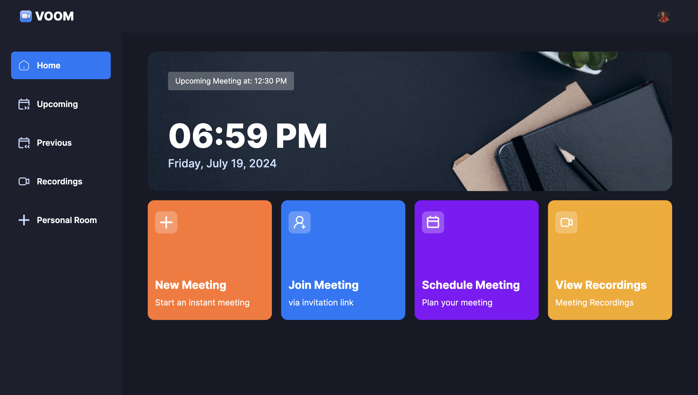

# AI Image Editor SaaS Platform

## Features
- Authentication using Clerk
- New Meeting setup, configuring camera and microphone settings before joining.
- Record Meeting, emoji reactions, screen sharing, muting/unmuting, sound adjustments, grid layout, participant list view, and individual participant management (pinning, muting, unmuting, blocking, allowing video share).
- Exit Meeting: Participants can leave a meeting, or creators can end it for all attendees.
- Schedule Future Meetings
- View Past Meetings List
- View Recorded Meetings
- Personal Room: Users have a personal room with a unique meeting link for instant meetings, shareable with others.
- Join Meetings via Link
- Secure Real-time Functionality
- Responsive Design


 <br/>


## Built With
- Next JS
- TypeScript 
- Clerk Auth 
- Tailwind CSS
- GetStream


## Usage

Navigate following commands in your terminal 

```bash
git clone https://github.com/vansh2308/video-conferencing-app.git
cd ./video-conferencing-app
npm i 
```

Create a file .env.local in root & provide the env varibles
```env 
NEXT_PUBLIC_CLERK_PUBLISHABLE_KEY=
CLERK_SECRET_KEY=

NEXT_PUBLIC_CLERK_SIGN_IN_URL=/sign-in
NEXT_PUBLIC_CLERK_SIGN_UP_URL=/sign-up

NEXT_PUBLIC_STREAM_API_KEY=
STREAM_SECRET_KEY=
```

Open terminal & execute:
```
npm run dev
```

Now type http://localhost:3000 in your browser. Bingo!!

## Author

- Github - [vansh2308](https://github.com/vansh2308)
- Website - [Vansh Agarwal](https://portfolio-website-self-xi.vercel.app/)
- Frontend Mentor - [@vansh2308](https://www.frontendmentor.io/profile/vansh2308)